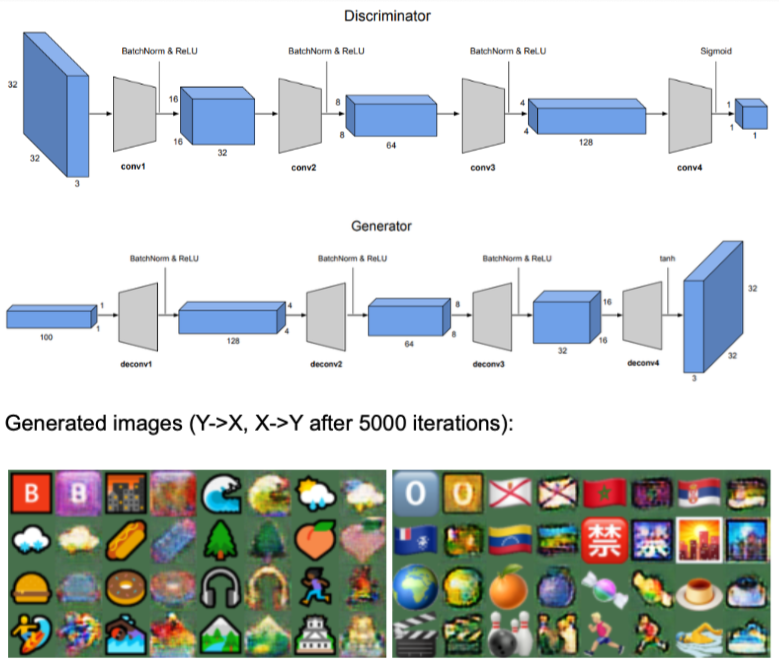

# Portfolio
---

## Data Science & Statistical Analysis Projects

### Deep Reinforcement Learning in Big Two

[View Report](https://github.com/jchow-ust/big2-rl/blob/main/DRL%20with%20Big2.pdf)

In this project supervised by Dr. Chen Qifeng, we developed Big2-RL, a reinforcement learning framework for Big Two (Cantonese: 鋤大弟), a four-player card-shedding game popular in Southeast Asia. The evaluation metric is average expected value (EV) of the winnings. Due to the symmetry of all players in the game, a reinforcement learning (RL) agent achieves an EV significantly above 0 has a winning strategy and is said to be performing well. Our reinforcement learning agent was trained on HKUST's HPC3 (High Performance Computing Cluster) for multiprocessing in order to improve training time and reduce variance. We consider a variety of training approaches and model architectures, and when combined with Deep Monte Carlo, we demonstrate that a simple MLP with residual connections trained against prior iterations of itself far outperforms other model architectures, managing to achieve a statistically significant average EV of +1.09/1000 hands (where the agent played all 4 positions in each hand) against prior copies of itself, and average EV of +1.81/1000 hands over the current state-of-the-art PPO algorithm proposed and implemented by Charlesworth ([GitHub](https://github.com/henrycharlesworth/big2_PPOalgorithm)). This thereby demonstrates the effectiveness of Monte Carlo methods for multi-agent imperfect information tasks. 

### Yelp Review Sentiment Analysis

[View Report](https://github.com/jchow-ust/jchow-ust.github.io/tree/main/projects/COMP4332_Project1_SentimentAnalysis/Submission/Report.pdf)

This project involves sentiment analysis of text from Yelp reviews of various businesses. The task is to predict the number of stars (1-5) from the corresponding rating text. As the dataset is imbalanced in favour of 5-star reviews, F1 score is used as the evaluation metric instead of accuracy. Interestingly, we observe that the best model (logistic regression) outperformed all CNN/RNN-based models we tested, though both had a validation F1 score ~10% higher than the baseline given by our instructor. Our final model's F1 score is one of the highest in the class, ranking in the top 10%.

---
### Social Network Link Prediction

[View Report](https://github.com/jchow-ust/jchow-ust.github.io/tree/main/quick-portfolio-master/projects/COMP4332_Project2_GraphLinkPrediction/Submission/Report.pdf)

This project involves link prediction between nodes of an undirected graph, where the nodes denote Yelp users and the links denote friendships between users. An ensemble of first-order and second-order random walk models were used to achieve an AUC-ROC score of 93.9% on the validation set, which outperforms the baseline given by our instructor. Additionally, our final model's AUC-ROC score ranked the highest in the class, outperforming all other teams.

---
### Rating Prediction with Wide & Deep Model

[View Report](https://github.com/jchow-ust/jchow-ust.github.io/tree/main/projects/COMP4332_Project3_WideDeepModel/Report%20%3.pdf)

This project involves predicting ratings (from 1-5) of users on given products given a sparse initial user-item rating matrix, which is typical of recommendation systems. The evaluation metric is the RMSE (Root Mean Squared Error.) After hyperparameter tuning and feature engineering, the wide and deep model achieves a validation RMSE of 1.014 which far outperforms the instructor baseline RMSE of 1.09. Our final model's RMSE was the lowest in the class and outperformed all other teams.

---
### Spark with Machine Learning

This repo contains an end-to-end implementation of machine learning with Spark. The task is to predict power output given a set of environmental readings from a power plant. This notebook was run on a Databricks Community Edition cluster (this can be done for free) after uploading the requisite data files to DBFS (Databricks File Storage). Models used include linear regression, decision tree, and random forest. It is observed that the random forest model outperforms both the decision tree and linear regression models.

---
### Regression Analysis Homework

This repo contains all homework done for the HKUST course "MATH3424 Regression Analysis". Homework is written in Markdown with commented R code. Topics covered in the course include:

1. Multiple Linear Regression

2. Regression Diagnostics: Analysis of Residuals

3. Qualitative Predictor Variables in Regression

4. Transformation of Variables and Collinearity, Variable and Model Selection

5. Logistic Regression

---
### Pawpularity Prediction of Pet Photos with CNN

[View Report](https://github.com/jchow-ust/jchow-ust.github.io/tree/main/projects/MATH4995_CapstoneProject/MATH4995_Pawpularity/4995_report_f.pdf)

Capstone project for predicting the popularity scores of pets based on their pictures on the online pet adoption website Petfinder.my. Although certain breeds may be more popular overall, it is hypothesised that features such as whether pets' faces are shown, or whether humans are present in the picture may influence how popular that pet profile is. This information can guide adoption agencies into taking profile pictures that are more eye-catching so that stray animals can find caring families as soon as possible.

---
### Simple C# Website interfacing with Oracle SQL Database]

This repo contains source code for building a simple website in C# that interfaces with Oracle SQL database to display results for popularly used queries.

---
### Emoji Style Transfer with DCGAN & CycleGAN 

This project involved implementing DCGAN and CycleGAN architectures from scratch for style transfer of emojis from Windows to Apple. Windows emojis tend to be flatter and have black borders, whereas Apple-style emojis tend to have depth and are borderless. After experimentation, it is observed that the introduction of the cycle consistency loss in CycleGAN greatly helped improve performance during such style transfer, as the vanilla DCGAN method produces checkerboard effects and the discriminator loss quickly saturates to 0 without causing the generator loss to further decrease.

---
### Turbulence detection in images

[Example turbulence detection classification in different bands]

[

This project involved classifying information received from different bands as different types of turbulence (moderate, severe, or none). F1 score was used as the evaluation metric. TODO expand

---
### Object detection with bounding boxes on Caltech birds dataset

[2 types of Caltech birds sample image classification]

[

This project involved bounding box detection of images from the Caltech birds dataset. IoU (intersection over union) (of predicted vs actual bounding boxes) was used as the evaluation metric. TODO expand

---
### COMP5214: Advanced Deep Learning Architectures

This repository contains completed homework assignments for course COMP5211: Advanced Deep Learning Architectures. Topics covered include:

1. KNN, MLP, and customised CNN implementation (MNIST) ([GitHub](https://github.com/jchow-ust/jchow-ust.github.io/tree/main/projects/5214_Assignments/HW1)

2. Word2Vec Embeddings and Graph Neural Networks ([GitHub](https://github.com/jchow-ust/jchow-ust.github.io/tree/main/projects/5214_Assignments/HW2))

---
### COMP4211: Machine Learning Assignments

This repository contains completed homework assignments for course COMP4211: Machine Learning. Topics covered include:

1. Multi-layer perceptron (MNIST) ([GitHub](https://github.com/jchow-ust/jchow-ust.github.io/tree/main/projects/COMP4211%20Machine%20Learning/Assignment%201%20MNIST))

2. Unsupervised learning (k-means clustering) and visualisation ([GitHub](https://github.com/jchow-ust/jchow-ust.github.io/blob/main/projects/COMP4211%20Machine%20Learning/Assignment%202%20Unsupervised%20Learning))

3. Reinforcement learning (Q-learning) ([GitHub](https://github.com/jchow-ust/jchow-ust.github.io/tree/main/projects/COMP4211%20Machine%20Learning/Assignment%203%20Reinforcement%20Learning))

---
## Software Engineering

### COVID-based game with GUI]

[image of COVID based game gameplay]

This repo contains source code for a GUI-based resource management game developed using JavaFX. Rules for the game are detailed in [TODO need find file].

---
### 'Battle City' arcade game in MIPS

[Image of battle city gameplay]

This repo contains source code in MIPS and Java for the implementation of the 'Battle City' arcade game, in which the player controls a tank and attempts to destroy enemy tanks on varied terrain.

---

## Miscellanea

### Simple Shell Commands with C/POSIX

This repo contains an implementation of simple shell commands (I/O redirection and two-level pipes) via POSIX file operations for understanding process management and inter-process communication.

---
### Banker's algorithm implementation in C

This repo contains an implementation of Banker's algorithm in C to detect deadlocks within a set of processes.

---
### COMP2012 Assignments

This repo contains class notes and assignments for the course COMP2012: Object-Oriented Programming and Data Structures with C++.

---
### MIPS scripts

Miscellaneous MIPS scripts for homework in the course COMP2611: Computer Organization.

---

Powered by Jekyll and the Minimal Theme.

